# Tool for visualization of agile metrics from GitHub

This tool is part of a study carried out in the scope of the Master's thesis in Information Systems Management at the Instituto Superior de Ciências do Trabalho e da Empresa - Instituto Universitário de Lisboa (ISCTE-IUL).

A dashboard, relevant for software development teams working according to agile methodologies, was developed from metrics extracted from the GitHub platform.

Here's a guide to using the tool.

# GitHub

First you need to define a Kanban board in GitHub for the repository.

The kanban board should have a basic template with the columns: To Do / In Progress / Done

Rules:
- The kanban board will be per repository
- The kanban board must specifically have as columns: To Do / In Progress / Done. You can change their name, but not add more
- The tasks on the board should be issue (cards are not considered, you must transform them to issue)
- Issue closed should be in the "Done" column and be closed "Close Issue"

1)  View your repositories.

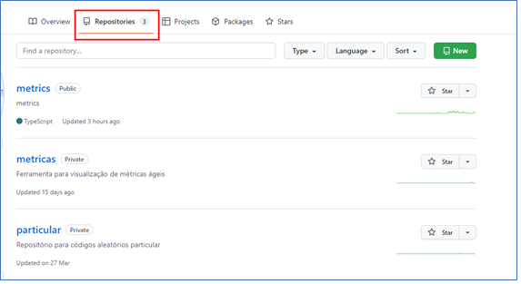

2) Create new project (Kanban board) for the repository.

a.	Go to the "Projects" tab

b.	Option "Projects"

c.	Click on "New Project"

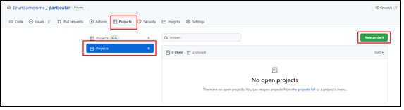

3) Enter the required data from the Board and click on "Create Project".

a.	Name of the Board

b.	Description

c.	Template: Select the "Basic Kanban" template.

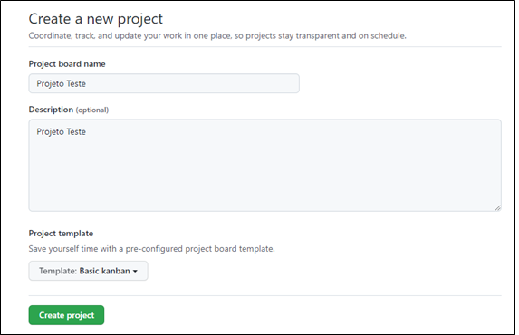

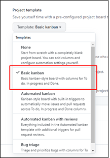

4) The frame will be created as follows.

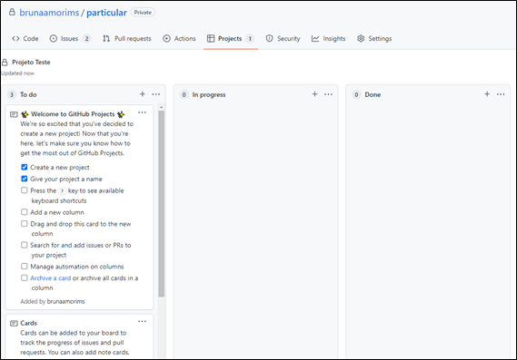

5) To create issues click on the "+", set card text and add (Add).

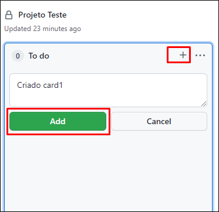

6) After creation, you must convert the card to issue. Click on the three dots on the card and "Convert to issue".  

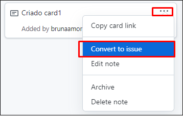

7) Then a screen will open to select the project repository and click "Convert to issue"

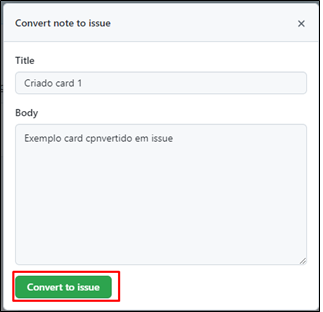

8) It will look like this.

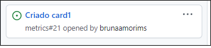

9) To close issue, move to "Done" column.  Click on the issue and then on "Close issue".

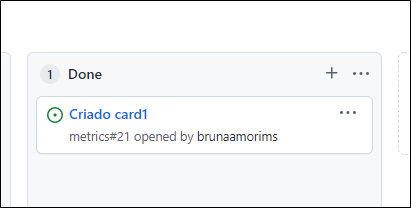

Clicking on the issue -> will open the following option to close.

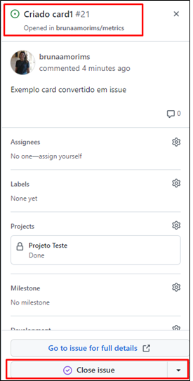

# Giro (http://3.249.103.74/)

Link: http://3.249.103.74/

You need to create an access token on GitHub: https://docs.github.com/pt/authentication/keeping-your-account-and-data-secure/creating-a-personal-access-token.

1) Set the start settings by clicking on "Settings".
 
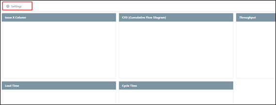

2) Settings screen:
a.	Enter GitHub user name and token.

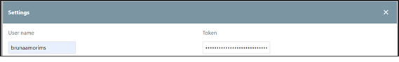

b.	Select the repository and the Kanban project.

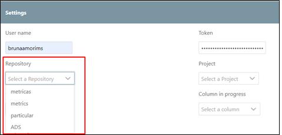

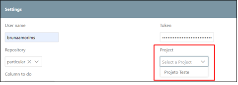

c.	Select the frenquency to see the data: day, week or month.

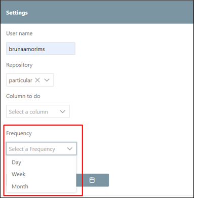

d.	Configure which column corresponds "To Do" and "In Progress".

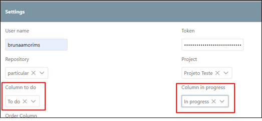

e.	Define the order of the columns (From Done to Done)

f.	Select start and end date of the issues.

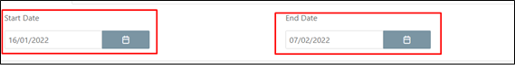

3)  The chart will show the result of the metrics.

a.	Issue x Column: Current quantity of issues per column

b.	CFD: graph showing the work progress 

c.	Throughput: Issues closed in the period

d.	Lead Time: Amount in days of "data close issue - data issue in To Do".

e.	Cycle Time: Amount in days of "data close issue - data issue in In Progress".

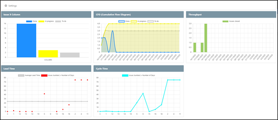

